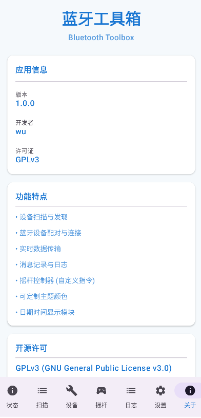

# 嵌入式调试宝库 (bttools)

Android 嵌入式万能调试工具，覆盖 **蓝牙经典 SPP / BLE / TCP / UDP** 四种链路，基于 Kotlin + Jetpack Compose + Material 3 构建。



## 功能

### 通信链路
- **蓝牙经典 SPP** — RFCOMM 串口，搜索/配对/连接，可作客户端或服务端
- **BLE 低功耗蓝牙** — 扫描设备、连接 GATT、自动选择写/通知特征，也可手动切换
- **TCP 客户端 / 服务端** — 通过 WiFi 调试嵌入式设备，显示本机 IP
- **UDP 收发** — 单播与广播，自定义本地监听端口与远端地址

### 终端调试
- **HEX / 文本双模收发** — 一键切换，多编码 (UTF-8 / ASCII / GBK)
- **行尾控制** — None / CR / LF / CRLF
- **定时循环发送** — 自定义周期，适合心跳/轮询
- **快捷命令** — 可增删、持久化，预置常用 AT 指令
- **收发计数** — 实时 RX / TX 字节统计
- **日志** — 时间戳、自动滚动、收/发过滤、HEX 视图、导出分享

### 其他
- **摇杆控制器** — 8 方向模拟摇杆 + A/B/X/Y，自定义指令并持久化
- **主题定制** — 深色/浅色模式，10 种主题色

## 要求

- 最低 Android 7.0 (API 24)
- 目标 Android 15 (API 36)

## 权限

| 权限 | 用途 |
|------|------|
| `BLUETOOTH` / `BLUETOOTH_ADMIN` | Android 11 以下蓝牙连接与扫描 |
| `BLUETOOTH_SCAN` / `BLUETOOTH_CONNECT` | Android 12+ 蓝牙扫描与连接 |
| `ACCESS_FINE_LOCATION` | Android 11 以下蓝牙/BLE 扫描必需 |
| `INTERNET` / `ACCESS_NETWORK_STATE` / `ACCESS_WIFI_STATE` | TCP/UDP 网络调试与本机 IP 显示 |

> Android 10/11 搜索蓝牙设备需要开启位置服务 (GPS)。

## 构建

```bash
./gradlew assembleDebug          # 构建 Debug APK
./gradlew testDebugUnitTest      # 运行单元测试 (HexUtils 等)
```

APK 生成路径：`app/build/outputs/apk/debug/`

## 项目结构

```
app/src/main/java/com/bttools/app/
├── MainActivity.kt              # 主 Activity：权限、扫描、连接、链路分发
├── SettingsManager.kt           # 设置与终端偏好持久化
├── BluetoothDiscoveryReceiver.kt# 经典蓝牙发现广播
├── core/                        # 统一传输层
│   ├── Transport.kt             # Transport 接口 / 枚举 / 监听器
│   ├── TerminalEngine.kt        # 状态中枢：收发记录、计数、定时发送
│   ├── HexUtils.kt              # HEX↔字节、编码、行尾组装
│   ├── NetworkUtils.kt          # 本机 IP
│   └── transports/              # SPP / BLE / TCP / UDP 四种实现
└── ui/                          # Compose UI
    ├── BluetoothAppNav.kt       # 底部导航 (状态/连接/终端/摇杆/日志/设置/关于)
    ├── ConnectScreen.kt         # 四链路连接配置
    ├── TerminalScreen.kt        # 统一收发终端
    ├── LogsScreen.kt / StatusScreen.kt / JoystickScreen.kt
    ├── SettingsScreen.kt / AboutScreen.kt
    └── theme/                   # Material 3 主题
```

## 技术栈

- **语言**: Kotlin
- **UI**: Jetpack Compose + Material 3
- **链路**: Android Bluetooth (RFCOMM/SPP, BLE GATT) + java.net (TCP/UDP)
- **构建**: Gradle + Kotlin DSL + Version Catalog
